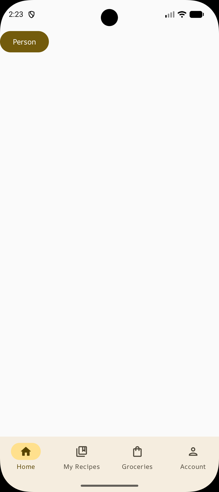
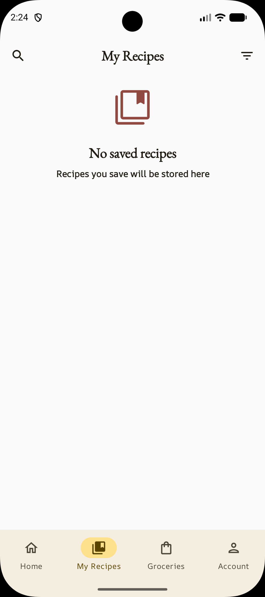
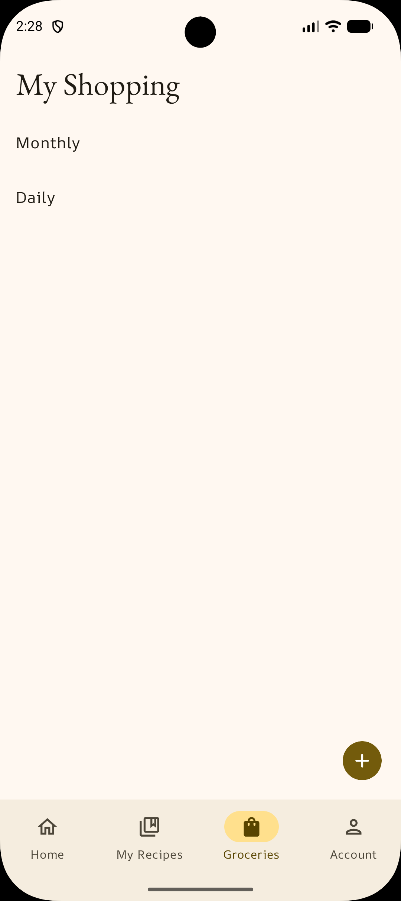
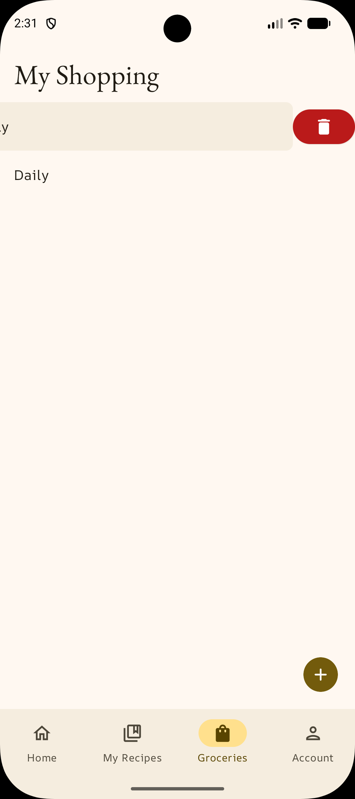
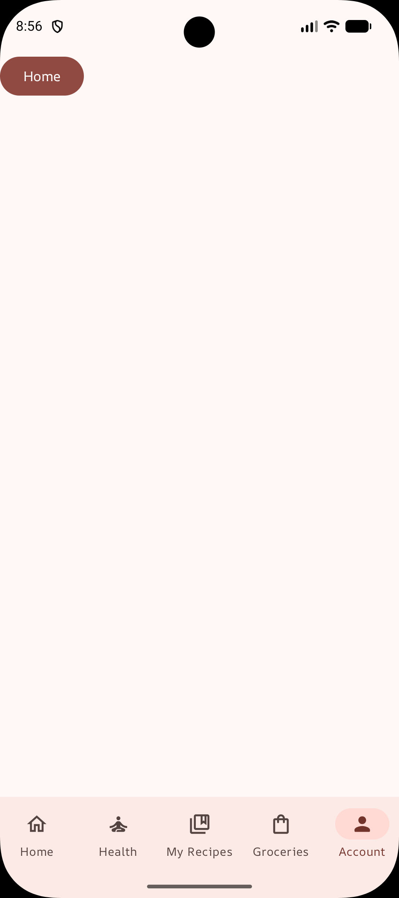

# MyHealth

MyHealth is a personal Android application for health and wellness management.

The project is built with modern Android development tools and is currently under active development.

## 🚧 Work in Progress
MyHealth is an ongoing personal project. Features are being developed incrementally while exploring modern Android development practices and architecture.

## Features

### Home
- Feature structure and navigation setup

### Health
- Feature structure and navigation setup

### Recipes
- Feature structure and navigation setup

### Grocery Lists
- Display grocery lists
- Create grocery lists by name
- Edit grocery list names
- Delete grocery lists

### Account
- Feature structure and navigation setup

## Screenshots

<p align="center">
  
  
  
  
  
</p>

## Tech Stack

- **Kotlin** - Primary programming language
- **Jetpack Compose** - Declarative UI toolkit
- **Material 3** - UI components and theming
- **Navigation 3** - App navigation
- **MVVM** - Presentation architecture
- **Room** - Local database
- **Hilt** - Dependency injection
- **Coroutines** - Asynchronous programming
- **Flow** - Reactive data streams

## Architecture

The project uses a feature-based structure with shared `core` modules.

```
MyHealth
├── app
│   ├── account
│   ├── groceries
│   ├── health
│   ├── home
│   └── recipes
│
└── core
    ├── common
    ├── database
    ├── data
    ├── designsystem
    ├── model
    └── navigation
```

The `app` module contains feature-specific UI and logic, while the `core` modules provide shared functionality across features.

## Project Status

Current development focuses on:
- Developing the Health feature

## Purpose

This project is built as a personal learning project to explore modern Android development and apply concepts such as:
- Jetpack Compose
- Navigation 3
- MVVM
- Room
- Hilt
- Coroutines
- Flow
- Modular architecture